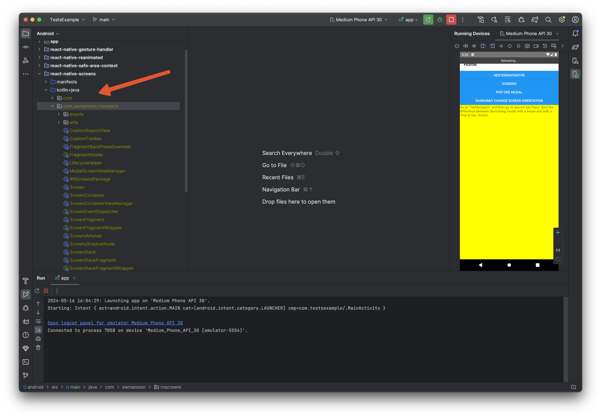
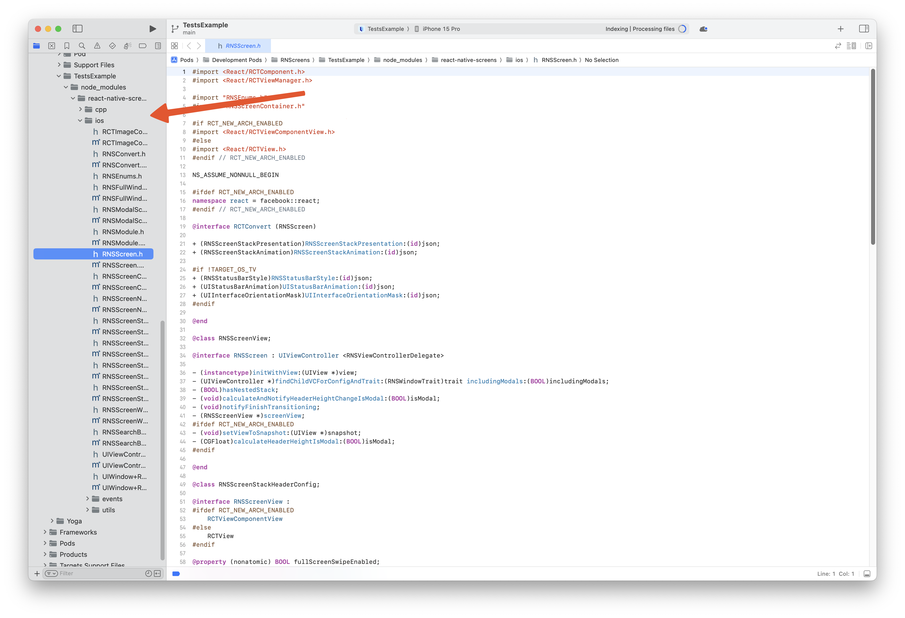

# Contributing to react-native-screens

## Welcome!

Thank you for considering contributing to `react-native-screens`. It's people like you that make open source projects thrive! We love to receive contributions from our community and there are many ways for _you_ to be a part of this.

### Found a bug?

If you’ve encountered a bug, don't hesitate to submit [an issue](https://github.com/software-mansion/react-native-screens/issues). Just check if someone didn't report it lately.

When filing an issue, make sure to provide:

- a short description of the problem
- an operating system that you are currently working on
- what happened
- what you expected to happen
- **snippet of code or Snack that reproduces the bug**. Check out [this guide](https://stackoverflow.com/help/minimal-reproducible-example)
- version of `react-native` and `react-native-screens`

### Got a question or an idea for a feature?

We use GitHub issues exclusively for tracking bugs. For questions and feature requests check out [Discussions](https://github.com/software-mansion/react-native-screens/discussions).

We've provided a template on GitHub that simplifies the process of filing an issue.

Following these few steps will show great respect for the time of the developers managing and developing this open-source project.

We inform you that unrespectful issues will be closed.

## Ways to Contribute

1. **Replying and handling open issues** &ndash; great way to contribute without writing a single line of code is triaging the issues. We often get issues that have generic errors, occur only in very specific cases, do not have proper example or reproducible repository. One way to help is preparing and filling those details, which will help other contributors get up to speed with the issue faster.

2. **Reviewing pull requests** &ndash; reviewing Pull Requests is crucial as it may help catch the corner cases or bugs that the developer did not notice. Every review matters as it may help polish quality of the library.

3. **Contributing to Code** &ndash; code-level contributions generally come in the form of pull requests. By contributing to code you help us with solving issues, fixing bugs or introducing new amazing features. If you want to start your adventure with open source it's good idea to take a look at [good first issue](https://github.com/software-mansion/react-native-screens/pulls?q=is%3Apr+is%3Aopen+label%3A%22good+first+issue%22) on GitHub. Read more about [contributing to code](#contributing-to-code).

### Repository overview

- `android` &ndash; source code of native implementation for Android
- `common` &ndash; C++ code related to components - shadow nodes and state
- `cpp` &ndash; C++ code for turbo modules
- `apps` &ndash; apps implementations shared by wrappers
- `Example` &ndash; paper version of React Native mobile example app from apps
- `FabricExample` &ndash; fabric version of React Native mobile example app from apps
- `gesture-handler` &ndash; interop between react-native-screens and react-native-gesture-handler
- `guides` &ndash; guides for developers
- `ios` &ndash; source code of native implementation for iOS
- `native-stack` &ndash; description of native stack v5, actual implementation can be found in `src/native-stack`, this will be deprecated in favor of react-navigation in near feature
- `react-navigation` &ndash; git submodule that refers to the react-navigation repository. Used mainly to test changes for newer versions of native stack.
- `reanimated` &ndash; interop between react-native-screens and react-native-reanimated
- `scripts` &ndash; utility scripts, used by CLI
- `src` &ndash; library TS core code
- `TVOSExample` &ndash; React Native example app for TVOS
- `windows` &ndash; source code of native implementation for Windows

## Handling open issues

Often understanding and reproducing the problem can be very time consuming task. The great way to help other contributors get up to the speed with solving an issue is providing detailed description and _reproducible_ example. The GitHub already has a template for creating issue, nevertheless we still encounter issues that do not have all necessary details, like:

- repository that we can clone and quickly see the problem,
- very generic reproduction steps,
- missing description,
- not related or truncated stack trace.

What you can do is ask the owner of an issue for such details or try provide them by yourself - try to reproduce the problem and provide missing details, so other developer can start debugging straightaway! 🎉

## Contributing to Code

Submitting Pull Requests that resolve issues is great way to contribute to Screens. If you eager to start contributing right away, we have list of [good first issues](https://github.com/software-mansion/react-native-screens/pulls?q=is%3Apr+is%3Aopen+label%3A%22good+first+issue%22) that contain bugs which have limited scope. In this section we'll describe in more details how to play around with react-native-screens setup.

> [!tip]
> For commits and pull request names we follow a [Conventional Commits](https://www.conventionalcommits.org/en/v1.0.0/) specification.

We have two types of sources: pure examples (apps/Example for source code) and examples, dedicated for tests from issues / pull requests (apps/src/tests for source code). The first work as a showcase of the library, the latter contains specific test cases that corresponds to GitHub issues. For example, `Test1864.tsx` corresponds to issue [#1864](https://github.com/software-mansion/react-native-screens/issues/1864). Our developer flow usually consists of creating new `Test*.tsx` file with code example that we try to fix or add. For new features we try to prepare showcases in Example app. The `apps/App` file is where you set the source code for the application to use by either leaving `<Example>` as is or replacing it with `<Test.Test*>`.
There are two separate applications: Example and FabricExample in root which are used as wrappers for running the examples depending on the architecture needed.

- `apps/Example` &ndash; source code with showcase app
- `apps/src/tests` &ndash; source code with test examples app
- `apps/App` &ndash; source code management
- `Example/src` &ndash; wrapper with paper architecture for showcase and test examples app
- `FabricExample/src` &ndash; wrapper with fabric architecture for showcase and test examples app
- `TVOSExample/src` &ndash; source code with example app for TVOS
- `src` &ndash; contains JS core code of the library
- `android` &ndash; source code related to Android native part
- `ios` &ndash; source code related to iOS native part

### Working on Android

To begin with, let install all dependencies:

1. `yarn`
2. `yarn submodules`
4. `cd Example` or `cd FabricExample` (depending on architecture you want to work on)
5. `yarn`
6. `yarn start` &ndash; make sure to start metro bundler before building the app in Android Studio

and open `react-native-screens/Example/android` with Android Studio.

The native source code of react-native-screens can be found in `react-native-screens` module, in `kotlin+java/com.swmansion.rnscreens` (ensuring your project view is in the `Android` mode). Making sure metro builder is run, you can now build React Native app or debug native code.

### Working on iOS

To begin with, let install all dependencies:

1. `yarn`
2. `yarn submodules`
4. `cd Example` or `cd FabricExample`
5. `yarn`
6. `(cd ios && pod install && cd ../)`
7. `yarn start` &ndash; make sure to start metro bundler before building the app in XCode.

and open `react-native-screens/Example/ios/ScreensExample.xcworkspace` with XCode.

To find the native source code of `react-native-screens` navigate to `Pods > Development Pods >  RNScreens > ScreensExample > node_modules > react-native-screens > ios` or `Pods > Development Pods > RNScreens > .. > ScreensExample > node_modules > react-native-screens > ios`. Making sure metro builder is run, you can now build React Native app or debug native code.

### Fabric

Codegen introduced by the [new architecture](https://github.com/reactwg/react-native-new-architecture/blob/main/docs/codegen.md) is fired automatically for iOS while runing `pod install` or when runing `FabricExample` in Android Studio. Developer can also run it manually by going into `./FabricExample/android` and running `./gradlew generateCodegenArtifactsFromSchema`. In both cases it is important to copy changed files from `/android/build/generated/source/codegen/java/com/facebook/react/viewmanagers/` to `android/src/paper/java/com/facebook/react/viewmanagers/`, so the interfaces are in sync for Paper architecture.

### Preparing Pull Request

When your code changes are ready, it is time to open your Pull Request. GitHub already has a template that helps you properly post your changes. The most crucial are:

1. **Description**:

- If you're solving specific issue, start with linking it.
- Write what are your motivations.

2. **Changes** - write what you have changes and why.
3. **Screenshots / GIFs** &ndash; if applicable it's great idea to attach screen or video before and after changes.
4. **Test code and steps to reproduce** &ndash; describe how others can test your change, if you didn't add `Test*.tsx` file it's good idea to add code snippets here.

### Do I need to prepare Pull Request for react-navigation too?

Currently, native stack is both in `react-native-screens` and `react-navigation`. `react-native-screens` contains native-stack v5 (`src/native-stack`), newer versions (v6, v7) are moved to `react-navigation` (available on branches `main`, `6.x`), hence in some cases it is necessary to prepare a pull request for `react-navigation` alongside the `react-native-screens` changes.

> [!CAUTION]
> Currently, in this setup we have some code duplications that we're aware of. NativeStack has been moved from react-native-screens/native-stack to @react-navigation/native since version v6. With react-native-screens v4 native stack v5 (react-native-screens/native-stack) is deprecated and marked for removal in the upcoming minor release, react-native-screens v4 will support only @react-navigation/native-stack v7.

#### Changes in native code

If your change is only related to the native code (for example you're fixing a bug), you **do not need** to create a PR in the `react-navigation` repository. `react-native-screens` is a separate library installed alongside `react-navigation`, so you can just increase version of `react-native-screens` in your package.json file.

#### Changes in JS code or both

If you're changing native-stack v5 (`src/native-stack`) you **do not need** to create a PR in the `react-navigation` repository.

If you're changing native-stack v6, v7 you **need to** create a PR in the `react-navigation` repository, since the code belongs there now.

If you're changing core functionality:

- If it's a bug fix and does not change the interface, then you **do not need** to create a PR in `react-navigation` repository.
- If you're adding a new feature or changing API, you **need to** create a PR in `react-navigation` repository, that exposes new changes.

> [!TIP]
> As the rule of thumb, if you're changing the public interface, you need to open PRs to the `react-navigation` repository.

### What is the flow to integrate with react-navigation

When you propose the changes that require creating a PR to the `react-navigation` repository, please follow these steps:

1. Create a PR with `react-native-screens` changes
2. Create a PR with changes for native-stack in `react-navigation`
3. Wait for both to pass the review and have all checks passed
4. Merge `react-native-screens` changes
5. Merge `react-navigation` changes
6. Upgrade the version of main branch index reference in `react-native-screens` (usually, git checkout on a submodule should be sufficient)
7. Post and merge ASAP upgrade of the main branch reference of `react-navigation`

> [!WARNING]
> Those steps are crucial, since changing the API in react-native-screens without merging react-navigation changes may cause both libraries going out of sync and crashing (i.e. because of not existing property). On the other hand, if you don't perform step 6 and 7, test examples and showcase app may stop working in react-native-screens.

See you on GitHub! 🎉
