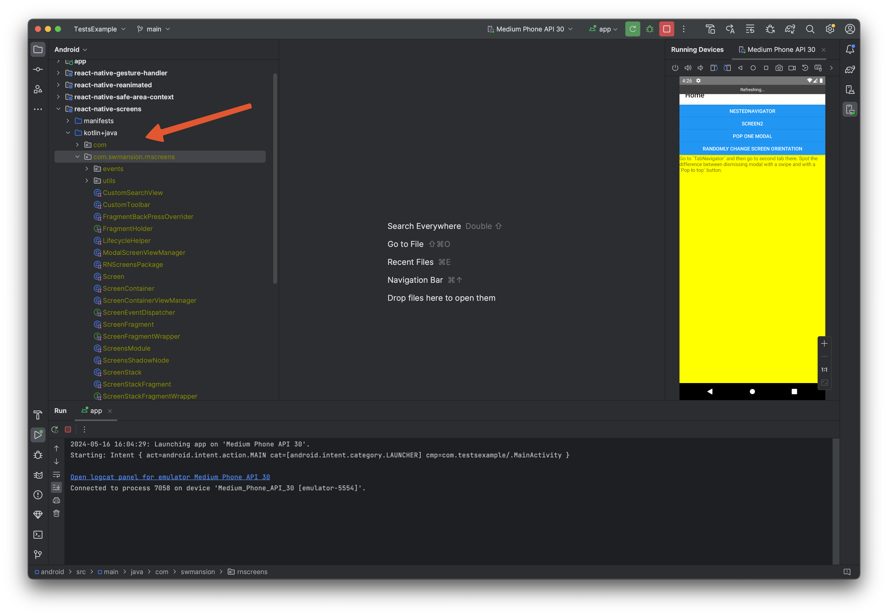
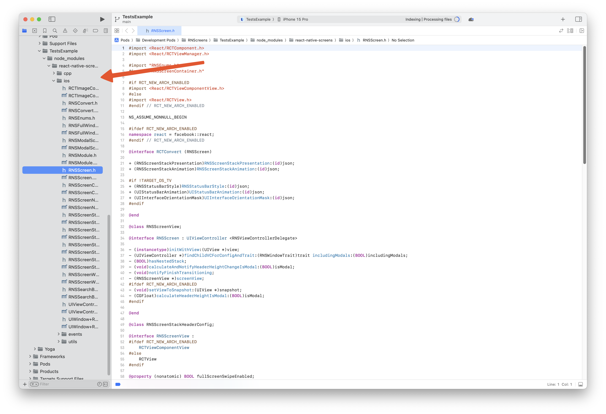

# Contributing to react-native-screens

## Welcome

Thank you for considering contributing to `react-native-screens`. It's people like
you that make open source projects thrive!

We are open for community contributions to the project and there are many ways
for you to make a change.

See the sections below for instructions on what you can do, to help us with the
project development.

## Ways to Contribute

1. **Reporting issues** &ndash; this is one of the most impactful things you can do.

   We do our best to ensure quality of the solution we produce. However, bugs happen.
   Some of them only surface in production-scale applications or we could simply miss something.
   Let us know. See the [section on bug reporting for instructions](#reporting-a-bug).

1. **Providing feedback and ideas** &ndash; a great form of support is telling us what you think!

   Maybe you have an idea for a feature that you find missing from the library, or
   you want to share your opinion on features that are currently planned for development?
   Please see [the dedicated section for instructions](#got-a-question-an-idea-for-a-feature-or-you-want-to-share-your-feedback).

1. **Replying and handling open issues** &ndash; a great way to contribute without writing a single line of code is triaging the issues.

   We often get issues that have generic errors, occur only in very specific cases,
   do not have a proper example or a reproducible repository.
   One way to help is preparing and providing those details,
   which will help other contributors get up to speed with the issue faster.

1. **Reviewing pull requests**

   Reviewing Pull Requests is crucial as it may help catch the corner cases or bugs that the developer did not notice.
   Every review matters as it may help polish the quality of the library.

1. **Contributing to Code**

   Code-level contributions generally come in the form of pull requests.
   By contributing to code you help us with solving issues, fixing bugs
   or introducing new amazing features. If you want to start your adventure
   Read more about [contributing to code](#contributing-to-code).
   with open source it's a good idea to take a look at [good first issue](https://github.com/software-mansion/react-native-screens/issues?q=is%3Aissue+is%3Aopen+label%3A%22good+first+issue%22) on GitHub or reach out to us via our [Discord](https://discord.gg/4a6nAnxfST) and ask what could you do.

### Reporting a bug

If you’ve encountered a bug, don't hesitate to submit [an issue](https://github.com/software-mansion/react-native-screens/issues).
Please do some brief research on whether the problem you are about to report has
already been reported or even solved.

When filing an issue, please make sure to provide us with any information that might be
helpful to identify and reproduce the undesired behavior.

Exact list of information we expect is included in our [issue template](/.github/ISSUE_TEMPLATE/bug-report.yml).
Please adhere to it.

One thing we want to emphasize here is the requirement for reproduction. It's crucial,
and it vastly increases the chances that we'll be able to solve the issue.

### Got a question, an idea for a feature, want to share your feedback?

> [!note]
> We use GitHub Issues exclusively for tracking bugs.
> We kindly inform you that misplaced issues or discussions might be closed without resolution.

For questions, feature requests and feedback threads we have a dedicated space in
the GitHub [Discussions](https://github.com/software-mansion/react-native-screens/discussions).

Following these few steps will show great respect for the time of the developers
managing and developing this open-source project.

### Repository overview

- `android` &ndash; source code of native implementation for Android
- `common` &ndash; C++ code related to components - shadow nodes and state
- `cpp` &ndash; C++ code for turbo modules
- `apps` &ndash; apps implementations shared by wrappers
- `FabricExample` &ndash; fabric version of React Native mobile example app from apps
- `gesture-handler` &ndash; interop between react-native-screens and react-native-gesture-handler
- `guides` &ndash; guides for developers
- `ios` &ndash; source code of native implementation for iOS
- `native-stack` &ndash; description of native stack v5, actual implementation can be found in `src/native-stack`, this will be deprecated in favor of react-navigation in near feature
- `react-navigation` &ndash; git submodule that refers to the react-navigation repository. Used mainly to test changes for newer versions of native stack.
- `reanimated` &ndash; interop between react-native-screens and react-native-reanimated
- `scripts` &ndash; utility scripts, used by CLI
- `src` &ndash; library TS core code
- `TVOSExample` &ndash; React Native example app for TVOS
- `windows` &ndash; source code of native implementation for Windows

## Handling open issues

Often understanding and reproducing the problem can be very time consuming task. The great way to help other contributors get up to the speed with solving an issue is providing detailed description and _reproducible_ example. The GitHub already has a template for creating issue, nevertheless we still encounter issues that do not have all necessary details, like:

- repository that we can clone and quickly see the problem,
- very generic reproduction steps,
- missing description,
- not related or truncated stack trace.

What you can do is ask the owner of an issue for such details or try provide them by yourself - try to reproduce the problem and provide missing details, so other developer can start debugging straightaway! 🎉

## Contributing to Code

Submitting a Pull Requests that resolve issues is a great way to contribute to Screens.
If you are eager to start contributing right away, we have list of [good first issues](https://github.com/software-mansion/react-native-screens/issues?q=is%3Aissue+is%3Aopen+label%3A%22good+first+issue%22) that contain bugs which have limited scope. In this section we'll describe in more details how to play around with react-native-screens setup.

> [!tip]
> For commits and pull request names we follow a [Conventional Commits](https://www.conventionalcommits.org/en/v1.0.0/) specification.

> [!note]
> Before committing yourself to a full implementation of a new feature, it's recommended to first open
> a discussion with an idea or feature suggestion to see whether the effect you want to achieve is aligned with
> current library development direction. We want to avoid situations where hours of work on a feature PR
> are wasted due to misalignment.

We have two types of sources: pure examples (apps/Example for source code) and examples, dedicated for tests from issues / pull requests (apps/src/tests for source code). The former work as a showcase of the library, the latter contain isolated props' behavior, selected interactions between props, and specific test cases that corresponds to GitHub issues. For example, `Test1864.tsx` corresponds to issue [#1864](https://github.com/software-mansion/react-native-screens/issues/1864). Our developer flow usually consists of creating new `Test*.tsx` file with code example that we try to fix or add. For new features we try to prepare dedicated showcases. The `apps/App` file is where you set the source code for the application to use by either leaving `<Example>` as is or replacing it with `<Test.Test*>`.

- `apps/Example` &ndash; source code with showcase app
- `apps/src/tests` &ndash; source code with test examples app
- `apps/App` &ndash; shared source code between our example apps
- `FabricExample/src` &ndash; wrapper with fabric architecture for showcase and test examples app
- `TVOSExample/src` &ndash; source code with example app for TVOS
- `src` &ndash; contains JS core code of the library
- `android` &ndash; source code related to Android native part
- `ios` &ndash; source code related to iOS native part

### Working on Android

To begin with, let install all dependencies:

1. `yarn`
2. `yarn submodules`
3. `cd FabricExample`
4. `yarn`
5. `yarn start` &ndash; make sure to start metro bundler before building the app in Android Studio.

Next, open `react-native-screens/FabricExample/android` with Android Studio.

The native source code of react-native-screens can be found in `react-native-screens` module, in `kotlin+java/com.swmansion.rnscreens` (ensuring your project view is in the `Android` mode). Making sure metro builder is run, you can now build React Native app or debug native code.

### Working on iOS

To begin with, let install all dependencies:

1. `yarn`
2. `yarn submodules`
3. `cd FabricExample`
4. `yarn`
5. `rbenv exec bundle install`
6. `(cd ios && rbenv exec bundle exec pod install && cd ../)`
7. `yarn start` &ndash; make sure to start metro bundler before building the app in XCode.

and open `react-native-screens/FabricExample/ios/FabricExample.xcworkspace` with XCode.

To find the native source code of `react-native-screens` navigate to `Pods > Development Pods >  RNScreens > FabricExample > node_modules > react-native-screens > ios` or `Pods > Development Pods > RNScreens > .. > FabricExample > node_modules > react-native-screens > ios`. Making sure metro builder is run, you can now build React Native app or debug native code.

### Fabric

Codegen introduced by the [new architecture](https://github.com/reactwg/react-native-new-architecture/blob/main/docs/codegen.md) is fired automatically for iOS while runing `pod install` or when runing `FabricExample` in Android Studio. Developer can also run it manually by going into `./FabricExample/android` and running `./gradlew generateCodegenArtifactsFromSchema`.

### Project Gamma

If you wish to work on next major, 5.0 version of Screens (codename: "Project Gamma") or just test the new components you need to do some additional configuration.

"Project Gamma" files are excluded from regular library builds, therefore any usage of "Gamma" components will crash in runtime when React Native discovers that
component implementation is missing. To include the implementation files **you need to set `RNS_GAMMA_ENABLED` environment variable to `1` before installing pods**.

Recommended approach is to set up [direnv](https://direnv.net/) as suggested [here](https://github.com/software-mansion/react-native-screens-labs/pull/197/files),
so that you don't have to do this manually each time.

### Preparing Pull Request

When your code changes are ready, it is time to open your Pull Request. GitHub already has a template that helps you properly post your changes. The most crucial are:

1. **Description**:

- If you're solving specific issue, start with linking it.
- Write what are your motivations.

1. **Changes** - write what you have changed and why.
2. **Screenshots / GIFs** &ndash; if applicable it's a great idea to attach screen or video before and after the changes.
3. **Test code and steps to reproduce** &ndash; describe how others can test your change, if you didn't add `Test*.tsx` file it's good idea to add code snippets here.

### Do I need to prepare Pull Request for react-navigation too?

Yes, to make the newly added feature available for a programmer's usage, you also need to expose it in downstream library.
React Navigation's native stack implementation is based on the components from `react-native-screens`, therefore when modifying the API,
we need to apply appropriate changes there too.

#### Changes in native code

If your change is only related to the native code (for example you're fixing a bug), you **do not need** to create a PR in the `react-navigation` repository. `react-native-screens` is a separate library installed alongside `react-navigation`, so you can just increase version of `react-native-screens` in your `package.json` file.

#### Changes in JS code or both

If you modify any API behavior (excluding fixes), you likely need to create a PR in the `react-navigation` repository to keep
the compatibility.

If you modify core functionality:

- If it's a bug fix and does not change the interface, then you **do not need** to create a PR in `react-navigation` repository.
- If you're adding a new feature or changing API, you **need to** create a PR in `react-navigation` repository, that exposes these new changes.

> [!TIP]
> As the rule of thumb, if you're changing the public interface, you need to open PRs to the `react-navigation` repository.

### What is the flow to integrate with react-navigation

When you propose the changes that require creating a PR to the `react-navigation` repository, please follow these steps:

1. Create a PR with `react-native-screens` changes
2. Create a PR with changes for native-stack in `react-navigation`
3. Wait for both to pass the review and have all checks passed
4. Merge `react-native-screens` changes
5. Merge `react-navigation` changes
6. Upgrade the version of main branch index reference in `react-native-screens` (usually, git checkout on a submodule should be sufficient)
7. Post and merge ASAP upgrade of the main branch reference of `react-navigation`

> [!WARNING]
> Those steps are crucial, since changing the API in react-native-screens without merging react-navigation changes may cause both libraries going out of sync and crashing (i.e. because of not existing property). On the other hand, if you don't perform step 6 and 7, test examples and showcase app may stop working in react-native-screens.

See you on GitHub! 🎉
