# FormSheet - Handling Flex in FormSheet's Content

## Problem

Currently, the `RNSScreenContentWrapper` (the view that adapts to the size of FormSheet's content) does not allow for defining styles that depend on the sheet's detents. This is because those styles would need to be applied to the parent view - `RNSModalScreen`.

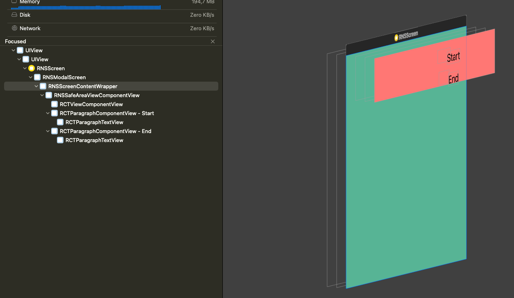

Preventing `RNSScreenContentWrapper` from resizing to match its parent was initially necessary due to the lack of synchronous updates in React Native. During transitions between detents, the size of `RNSModalScreen` is updated **asynchronously** in the Shadow Tree. This leads to a mismatch with the current native state and causes the content to flicker, as shown in the video:

[Screen content flickers](form-sheet-flex-assets/jumping-content.mp4)

These styles are controlled by `ScreenStackItem`:  
https://github.com/software-mansion/react-native-screens/blob/338df214aeafbfa01252ffc0aa8fa97728100a1f/src/components/ScreenStackItem.tsx#L216-L218

By disabling child resizing to the parent, the children of `RNSScreenContentWrapper` lose a frame of `RNSModalScreen` as a reference. Setting `flex: 1` does not work since there is no defined height of the parent container.

One solution would be to make `RNSScreen` the reference point - having a **synchronous** update of the layout state in Yoga. This would allow components using `flex: 1` to correctly adapt to the `RNSScreen` size immediately.

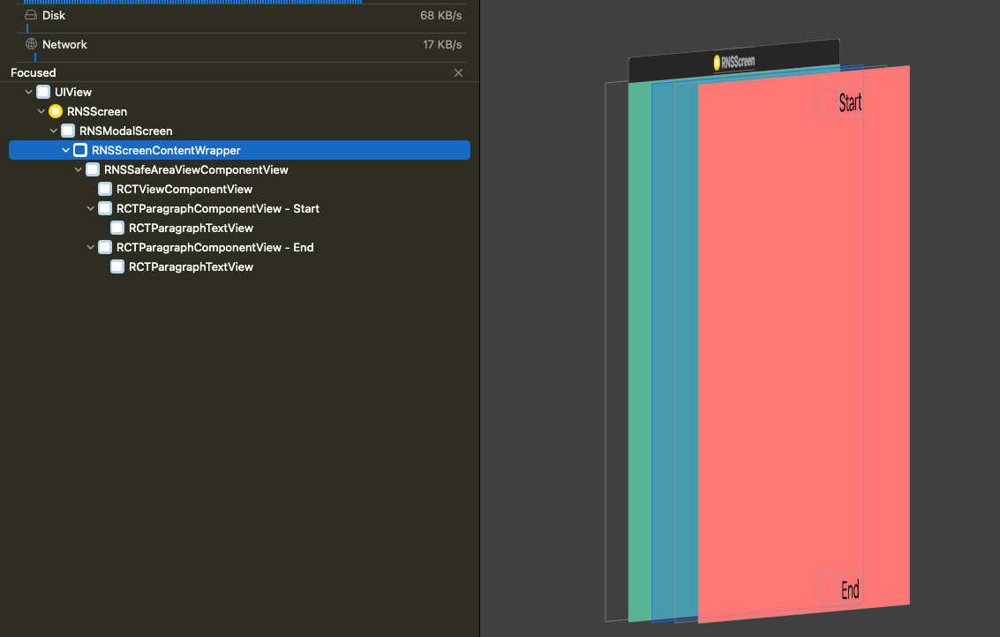

**This implementation becomes possible in React Native 0.82+, but has the significant drawback, which is the inconsistency across platforms, remains.**

## Platform Differences

On Android, the FormSheet follows a different implementation model. Unlike on iOS, it knows how to compute its maximum dimensions using:

- Defined `sheetDetents` (by taking the maximum detent value as the multiplier)
- The renderable space (the initial height being a reference how high the sheet would be if the maximum detent would be set to 1.0)

Because Android also lacks synchronous state updates, to avoid the similar issues with content flickering, the following approach was chosen:

- The `FormSheet` always renders at its **maximum size**.
- **Only a portion of the component is shown** if the active detent is different from the maximum detent.
- The transition between detents is handled using **`translateY`**.

On the other hand, on iOS:

- The FormSheet's **size dynamically adapts** based on the active detent.
- Components aligned to the bottom of the `FormSheet` are **bound to the bottom edge**.
- The transition is handled via changing the **`height`** of the sheet.

| Platform | Minimal Detent | Maximal Detent |
|----------|----------------|----------------|
| Android  | 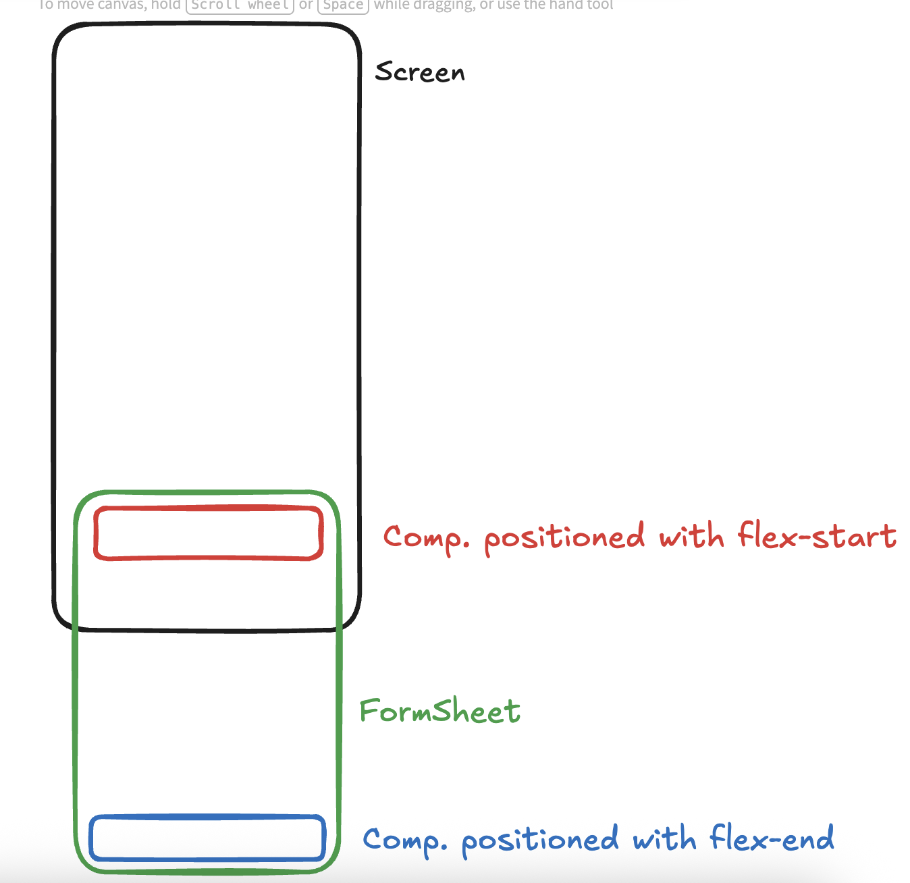 | 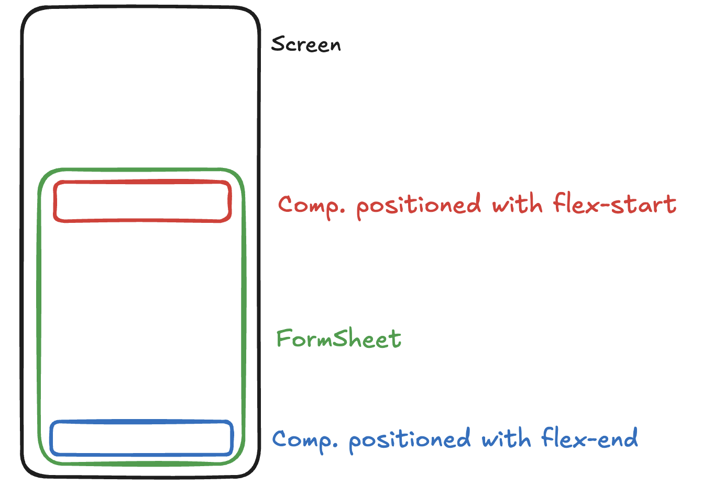 |
| iOS      | 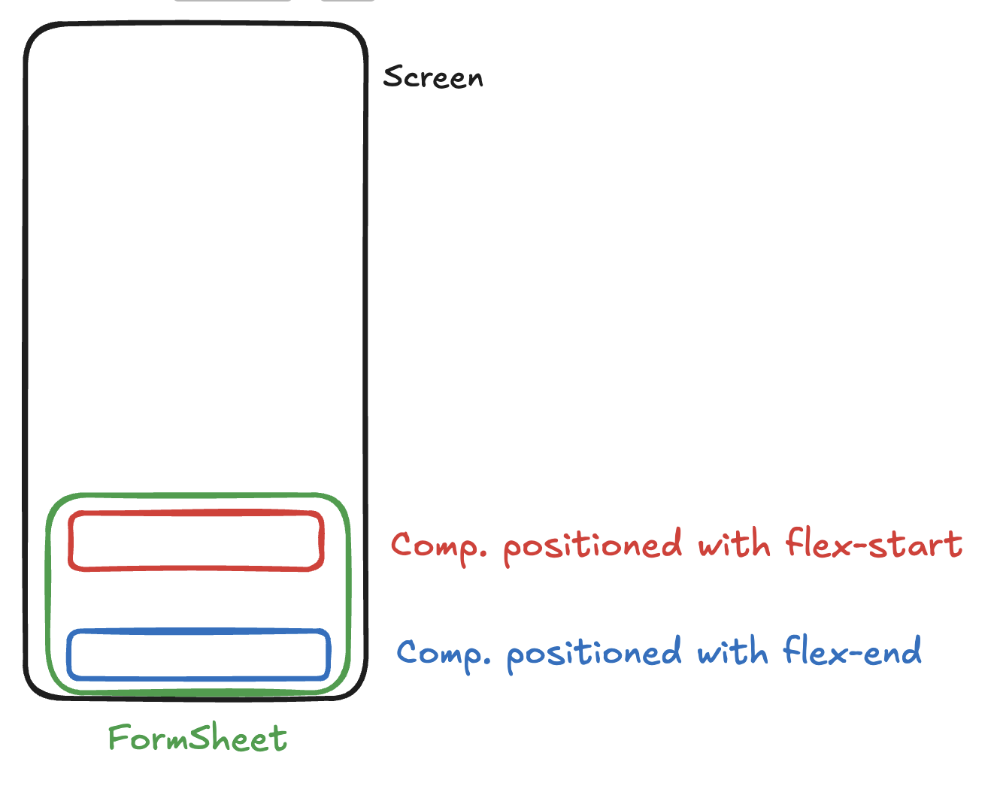 | 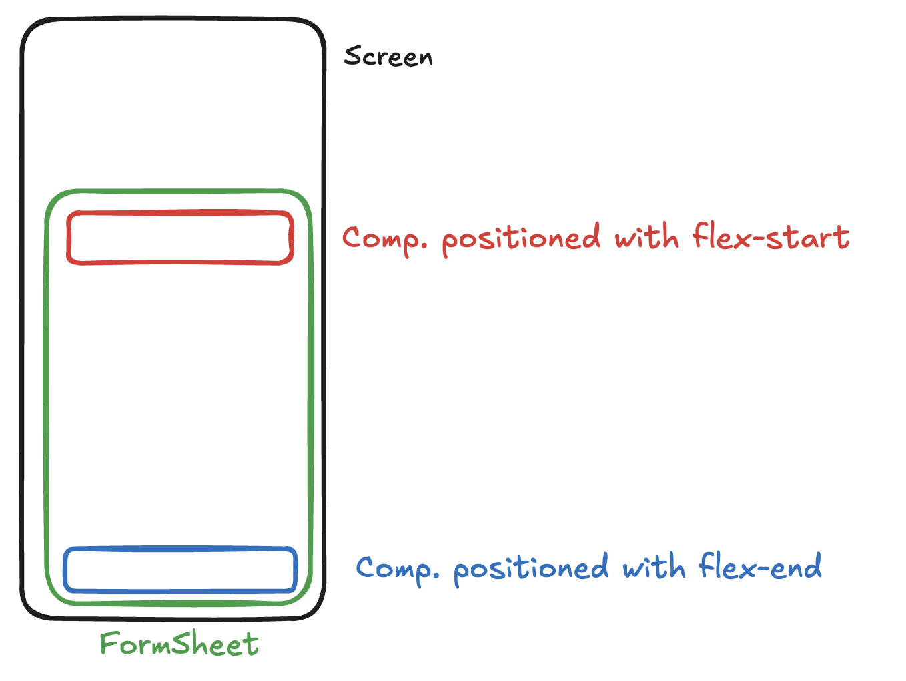 |

These platform differences create challenges for implementing consistent cross-platform behavior, particularly when using dynamic layout using `flex`.

## Potential Solution

Adding `flex` to iOS styles when `fitToContents` is not used and synchronous updates are available. In the current scenario, we have the following hierarchy, where the content determines the size of `ScreenContentWrapper` and is unaware of the height of the `Screen` frame. Due to the style `position: absolute, top: 0, left: 0, right: 0`, we lose the binding to the bottom edge of the `Screen` component.

```
- Screen: (x1, y1, w1, *h1*)
-- ScreenContentWrapper: (x1, y1, w1, *h2*)
--- Content: (x1, y1, w1, *h2*)
---- Highest View: (x1, y1, w1, *h2*)
```

<table>
  <tr>
    <td>
      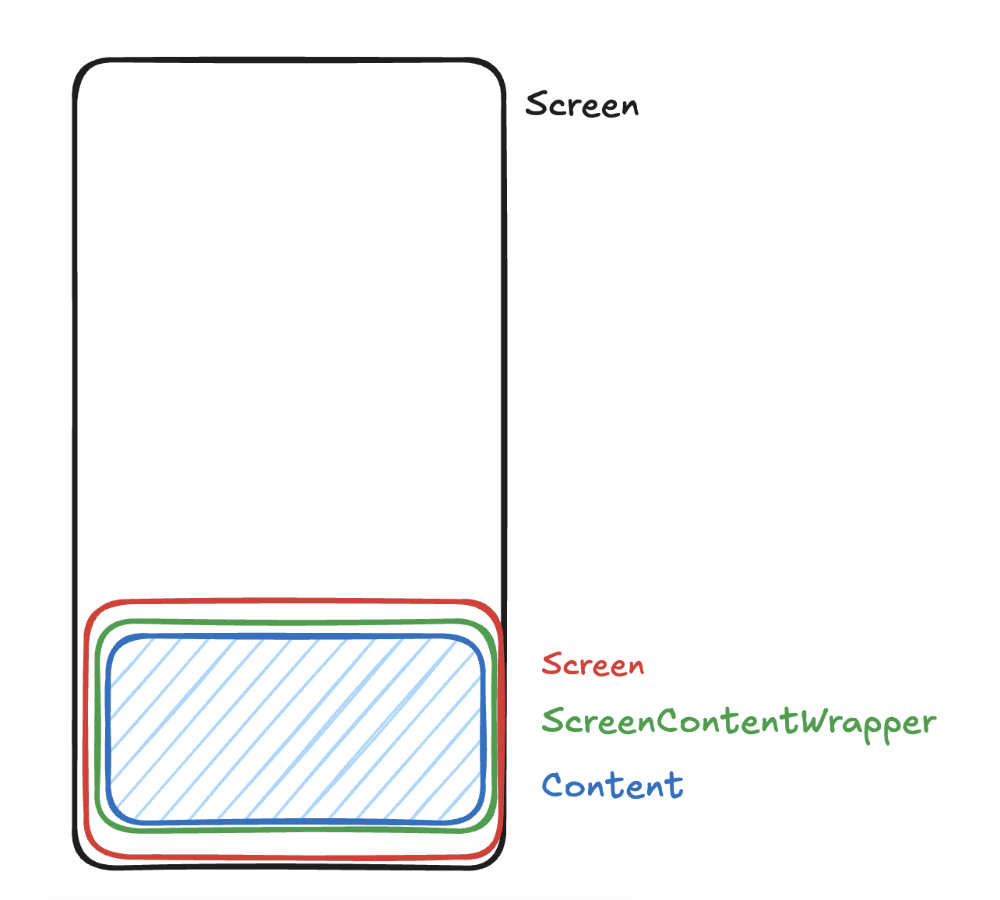<br>
      <p>iOS min detent</p>
    </td>
    <td>
      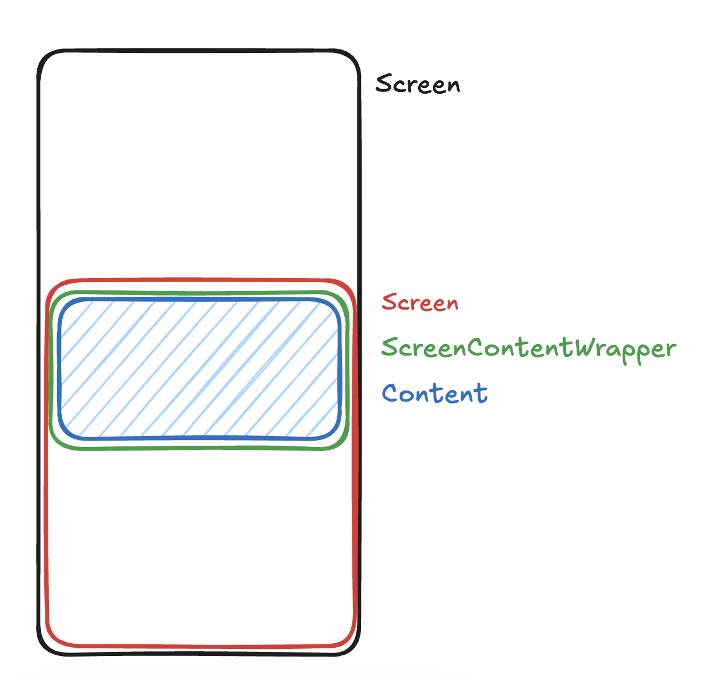<br>
      <p>iOS max detent</p>
    </td>
  </tr>
</table>

In the above situation, applying a `flex` style will not have any impact on Y axis, because the content determines the maximum height to which the content extends, so no deterministic gap can be formed on its own.
Allowing the use of the `flex` style (when `fitToContents` isn't used) enables achieving the following hierarchy:

```
- Screen: (x1, y1, w1, *h1*)
-- ScreenContentWrapper: (x1, y1, w1, *h1*)
--- Content: (x1, y1, w1, *h1*)
---- Highest View: (x1, y1, w1, *h1*)
```

<table>
  <tr>
    <td>
      <br>
      <p>iOS min detent</p>
    </td>
    <td>
      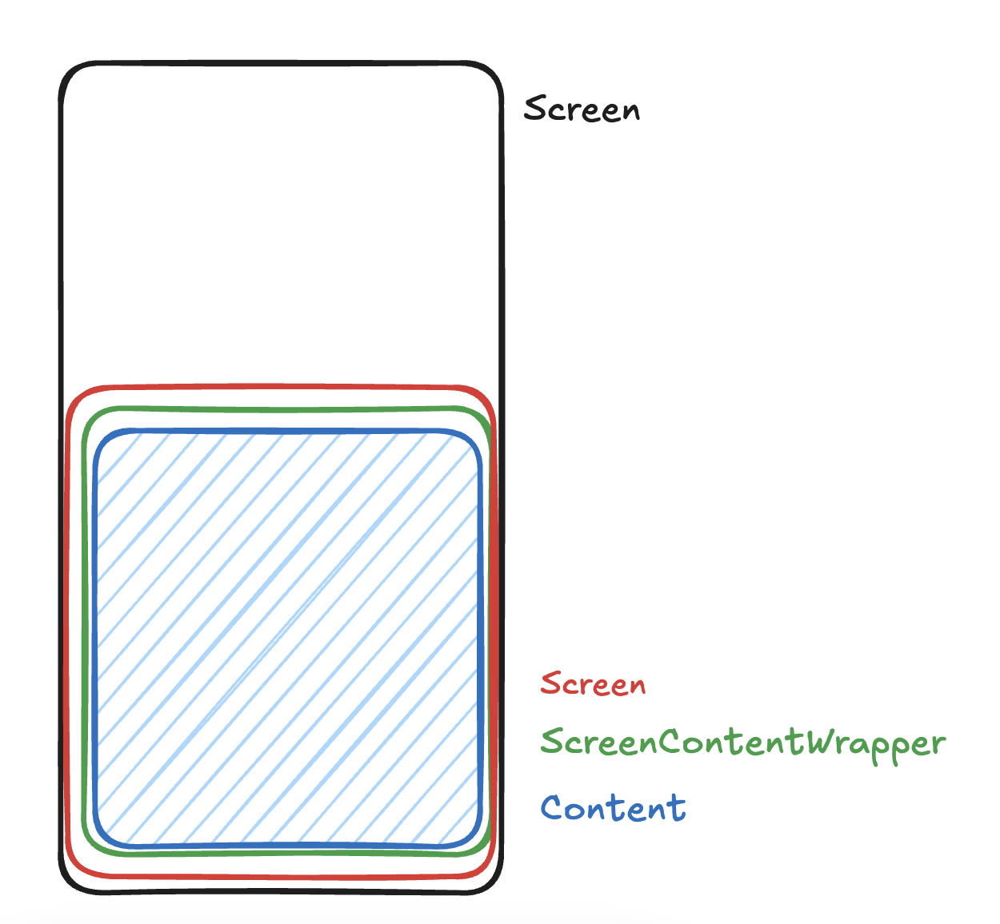<br>
      <p>iOS max detent</p>
    </td>
  </tr>
</table>

Applying a flex style to the `Content` makes it possible to position `Highest View` using the flexbox model relatively to the current size of the `Screen`, determined by the active detent.

Adding support for `flex` on iOS is possible, but it results in completely different styling behavior. Before applying that solution, the inconsistency is also present - the component renders correctly on Android, but not on iOS. Therefore, we believe a smaller issue is dealing with styling differences across platforms rather than losing complete functionality on one of them.

However, there are certain technical limitations that make implementing a unified solution difficult:

- Due to the **lack of synchronous ShadowNode state updates on Android**, we cannot replicate the iOS model (which involves changing the component's height dynamically) without causing content to flicker.
- On iOS, we **cannot reliably determine the large detent value based on the medium detent**. These values are defined by the system. Starting from iOS 16, Apple provides an API revealing these values, but we must still support iOS 15, which does not give us access to that data.

**Once we decide to drop support for iOS 15, we could potentially migrate the current iOS implementation to use the Android-like fixed-height FormSheet model.**

Until then, supporting styling with `flex: 1` may cause visual inconsistencies. These are documented below in table format:

---

### 1. FormSheet with Detents, Content Styled with Flex

Differences:
- On Android, the "End" text becomes visible only when expanded to the maximum detent.
- On iOS, the "End" text is always visible.

| Platform | Android | iOS |
|----------|---------|-----|
| Minimal Detent | 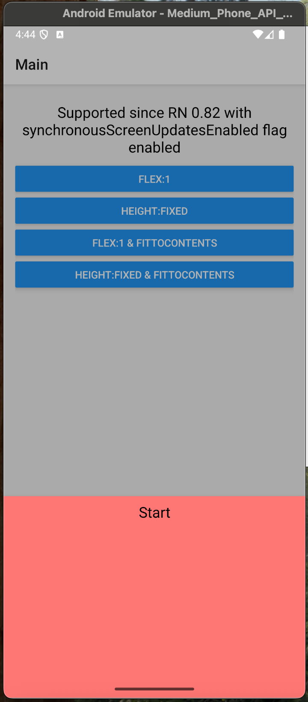 | 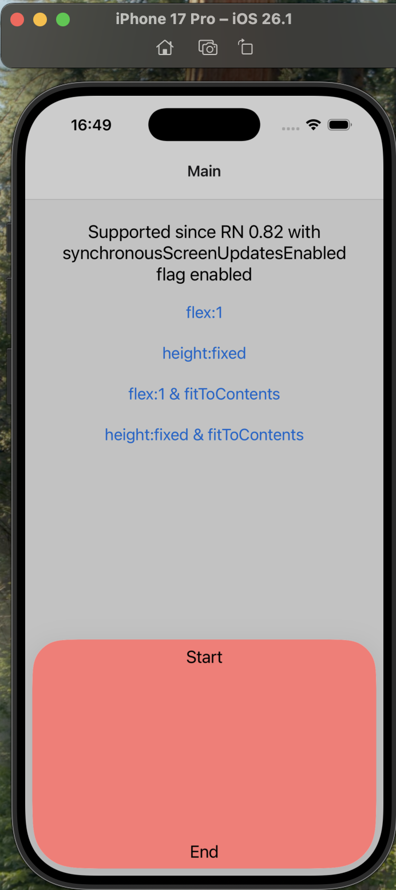 |
| Maximal Detent | 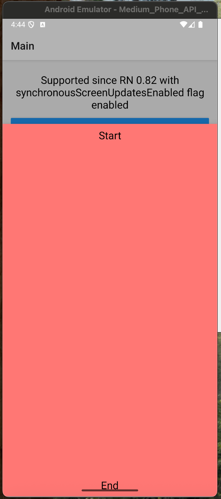 | 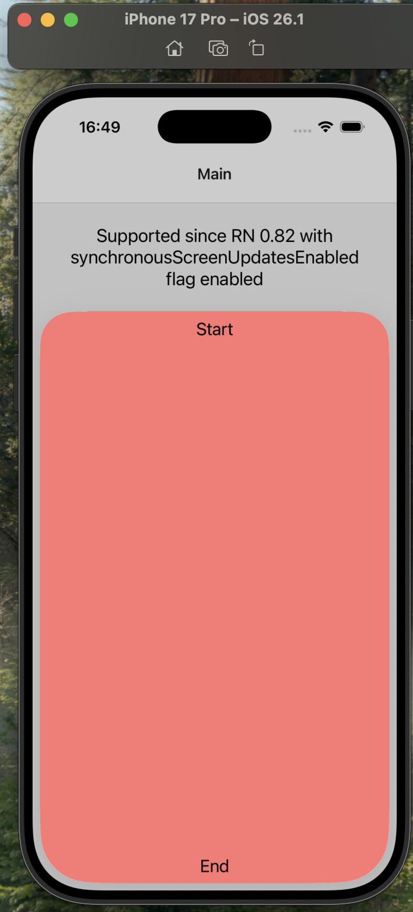 |

---

### 2. FormSheet with Detents, Content Styled with maxHeight

Differences:
- No visual differences.

| Platform | Android | iOS |
|----------|---------|-----|
| Minimal Detent | 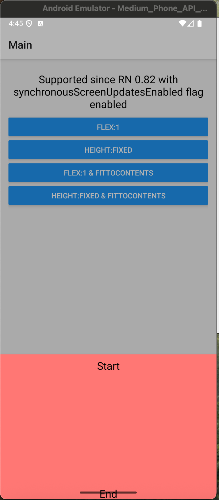 | 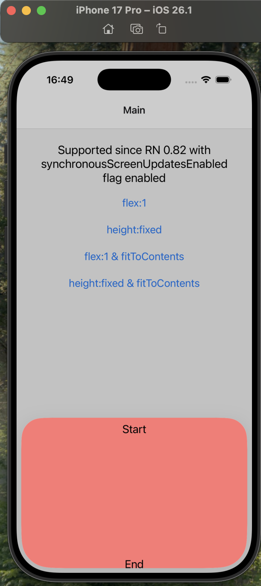 |
| Maximal Detent | 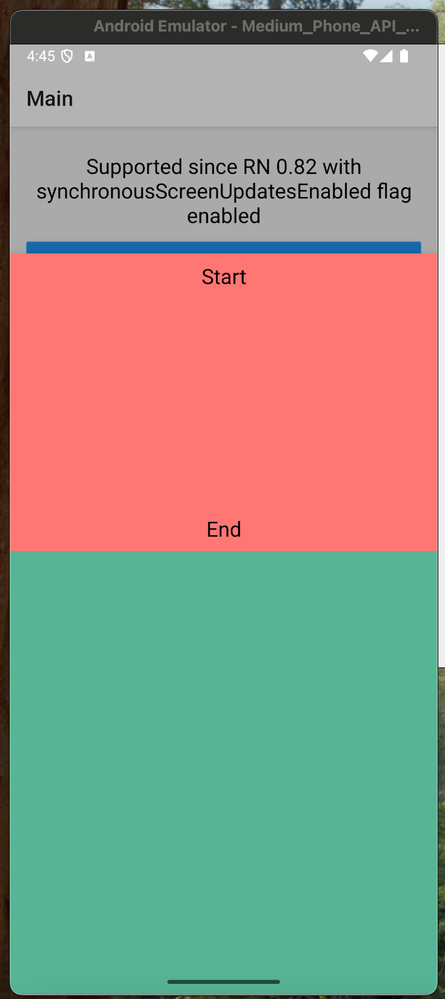 | 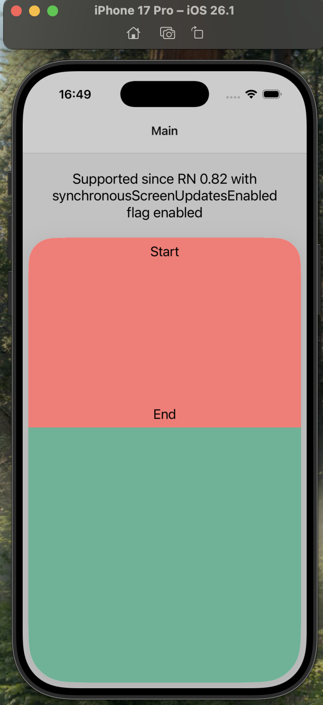 |

---

### 3. FormSheet with fitToContents, Content Styled with Flex

Differences:
- Android does not support `fitToContents` when using `flex`, because having `flex` we cannot determine the content size precisely - we do not support this use case. 
- On iOS, it works by coincidence.
- `fitToContents` requires knowing the content height, which is not possible when using flex.

| Platform | Android | iOS |
|----------|---------|-----|
| Fit To Contents | ") | 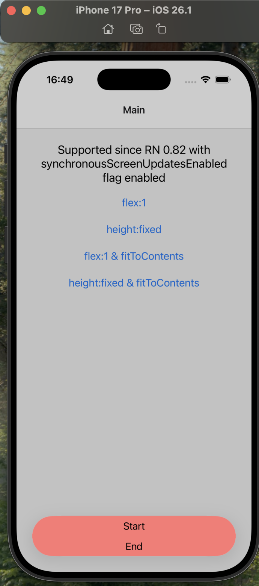 |

---

### 4. FormSheet with fitToContents, Content Styled with maxHeight

Differences:
- iOS automatically respects the bottom inset of the navigation bar. 
- On Android, this must be handled manually by wrapping the component with `SafeAreaView`.

| Platform | Android | iOS |
|----------|---------|-----|
| Fit To Contents | 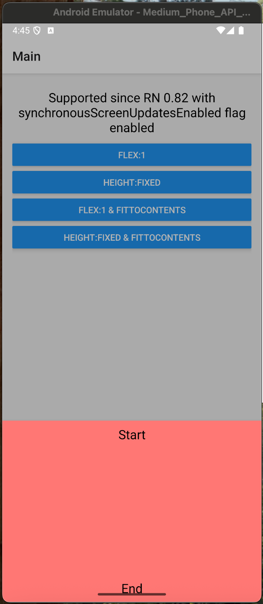 | 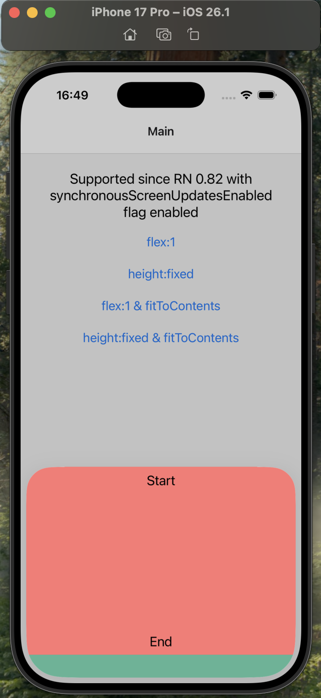 |
